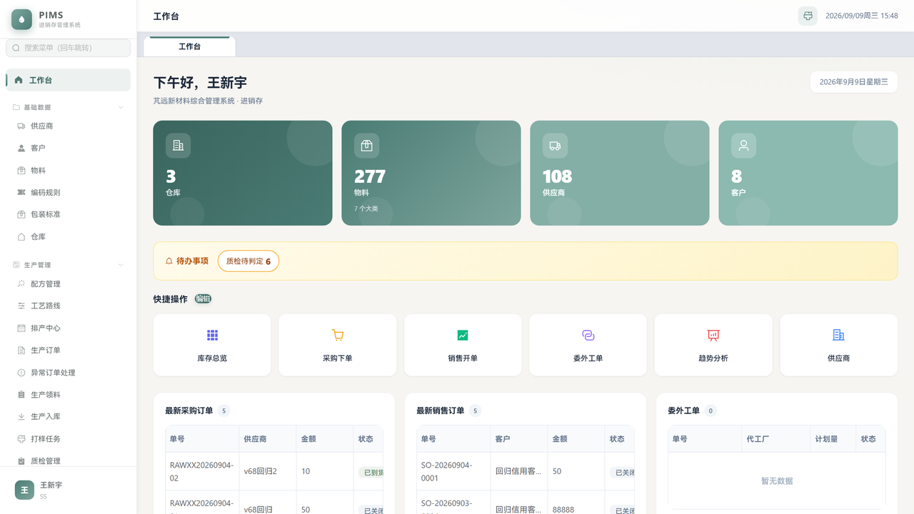
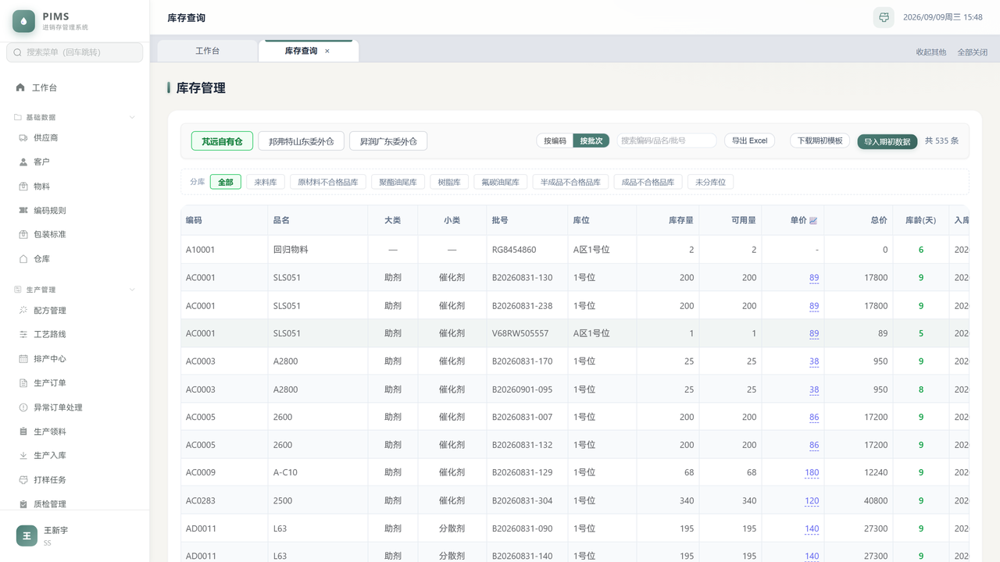
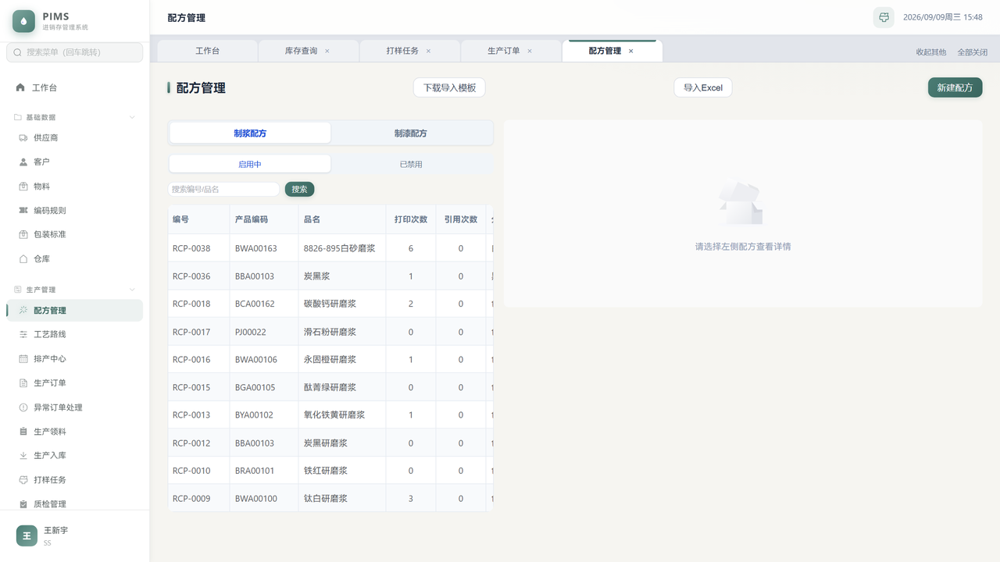
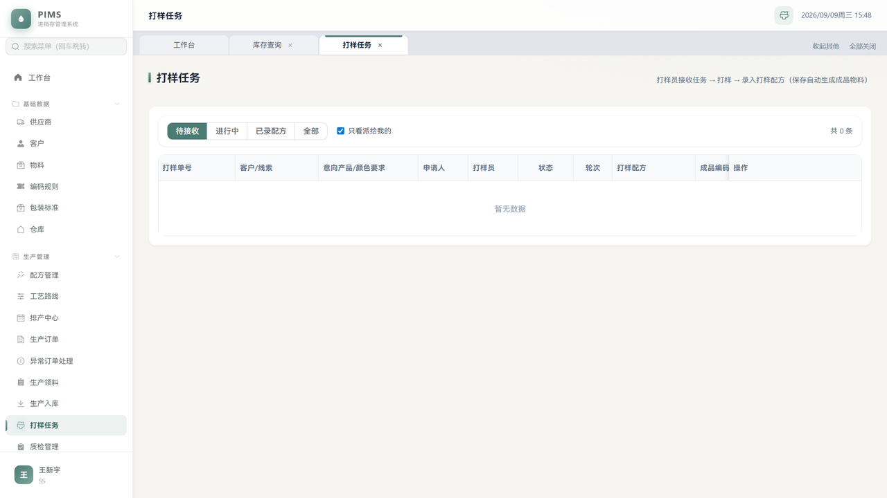
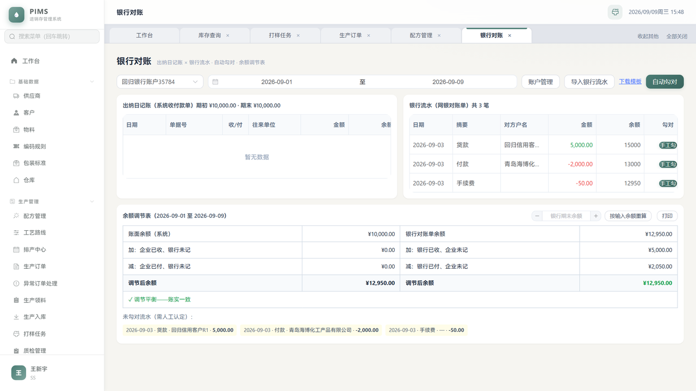
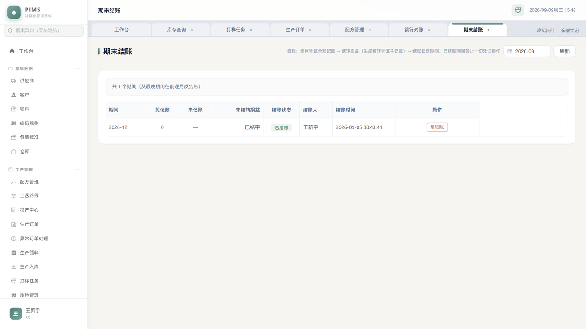
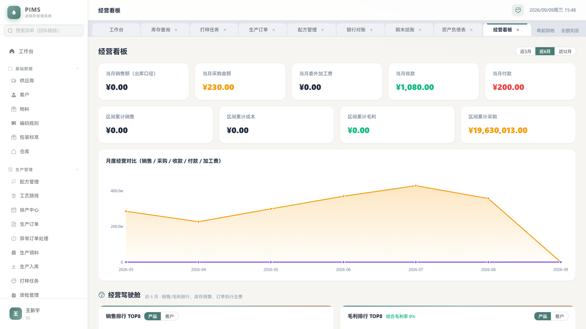
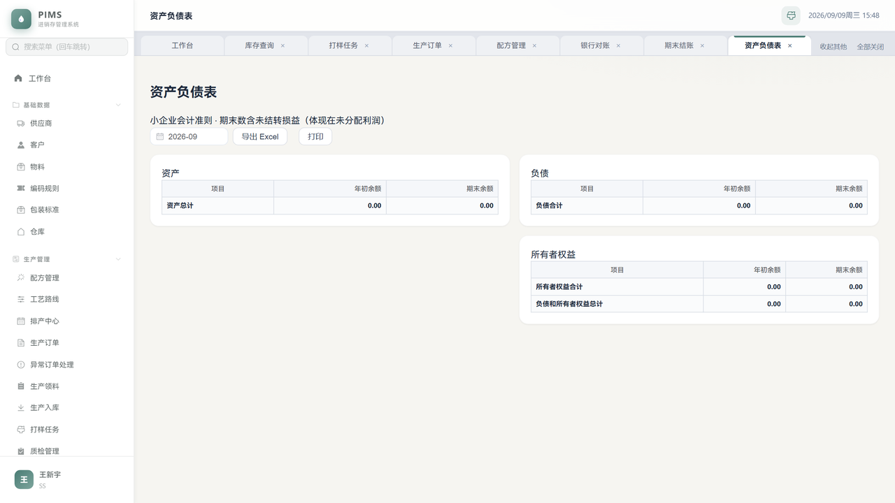
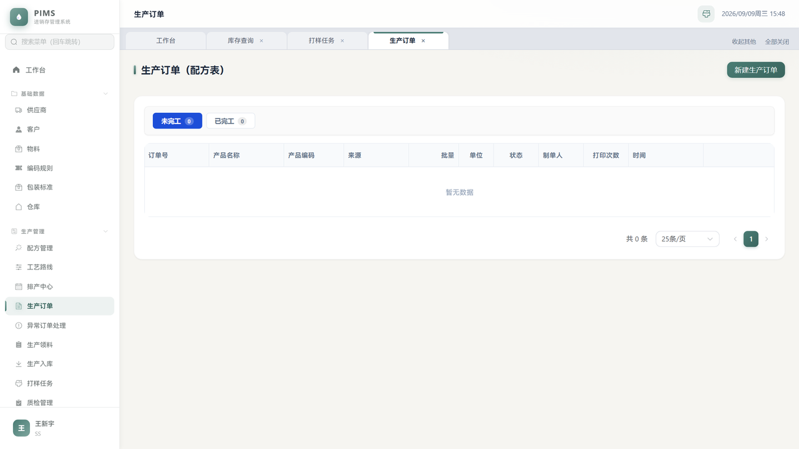

# 芃远综合管理系统（PIMS）

> 广东芃远新材料有限公司自研一体化 ERP —— 一家工业漆（卷材/彩涂板用油性高温烤漆）涂料厂的全业务链管理平台。
> 单 jar 部署、零外部依赖（含数据库），内网服务器一条命令起服务。

[](https://github.com/hellowangxinyu/PIMS/actions/workflows/ci.yml)

---

## 界面预览

| 工作台（待办聚合+看板） | 库存查询（仓库→分库两级+大类小类列+周转天数） |
|:---:|:---:|
|  |  |

| 配方管理（两级配方树+成本） | 打样任务（打样员工作台：接收→录配方→打印） |
|:---:|:---:|
|  |  |

| 银行对账（流水导入+自动勾对+余额调节表） | 期末结账（结账前置校验链） |
|:---:|:---:|
|  |  |

| 经营看板（驾驶舱） | 资产负债表 |
|:---:|:---:|
|  |  |

<details>
<summary>更多截图（登录页 / 生产订单 / 移动端适配等）</summary>

| 登录页 | 生产订单 |
|:---:|:---:|
|  |  |

</details>

---

## 一、这是什么系统

覆盖涂料厂从**请购 → 采购 → 来料质检 → 库存 → 生产/委外 → 销售发货 → 财务总账**的完整闭环：

```
业务单据一确认 ──→ 库存实时变动 + 应收应付自动立账
                │
     ┌──────────┴──────────┐
     ▼                     ▼
 收付款核销(FIFO)      凭证→结账→三大报表
 银行对账/余额调节表    资产负债表/利润表/现金流量表
```

**典型业务特色**（区别于通用 ERP 的行业设计）：

| 特色 | 说明 |
|---|---|
| 批号全程追溯 | 物料必须精确到批号、仓库精确到库位；批号贯穿质检→入库→领料→发货→投诉追溯全链 |
| 配方树体系 | 制浆(GRINDING)/制漆(TINTING) 两级配方树，半成品挂子配方引用；打样配方一键转制漆配方（用量按标准批量折算） |
| 打样任务流 | 内勤派发→打样员接收→录入打样配方（自动算估算成本）→保存即生成成品物料与 9 位属性编码→打印配方单 |
| 质检模板快照 | 按物料大类 7 套模板，判定逐项实测自动汇总；历史单持有当时快照不受模板改动影响 |
| 隔离仓体系 | 不合格品分库（原材料/半成品/成品三类）、油尾库对正常业务全封闭，仅报废/退货通道放行 |
| 过期复检 | 到期批次自动隔离，复检合格更新保质期即放行 |
| 价税分离 | 采购含税价入库、台账成本折不含税（税率字典可配），利润试算收入成本同口径 |
| 四档计价 | 个别计价 / FIFO / 移动加权 / 全月平均，全局切换 |
| 油尾消化 | 客户退回的已开桶油漆专入油尾库，只能在制漆配方中按主材+色系匹配消化 |

## 二、功能模块一览（97 个页面）

| 模块 | 主要功能 |
|---|---|
| **基础数据** | 物料（6/8/9 位属性语义编码自动生成）、供应商、客户、仓库→分库→库位三级、编码规则、包装标准 |
| **采购** | 请购单（MRP 一键生成）、原料/成品采购、到货三道防线校验、质检联动、退货、供应商质量追溯 |
| **生产** | 配方管理（版本/变更日志/成本）、工艺路线、排产中心、生产订单（投出比/异常订单）、领料/退料/补领、生产入库自动完工 |
| **委外** | 委外订单、发料、收回入库（加工费应付自动立账） |
| **销售** | 报价单（状态机转订单）、价格政策、销售订单（信用额度软拦截）、送货单打印、出库立应收、退货红冲、油尾退回、打样、客户投诉、CRM |
| **库存** | 双视图查询（按编码/按批次，分库筛选+大类小类列+周转天数）、盘点、其他出入库、期初导入、低库存预警、过期预警 |
| **财务** | 应收应付台账、收付款核销、预收预付、发票红冲、费用、银行对账（流水导入/自动勾对/余额调节表）、工资、固定资产折旧、会计凭证、期末结账/年结、三大报表、成本核算、利润试算、客户/供应商对账单、应收应付周转率 |
| **协同** | 任务督办、每周议题、研发进度、AI 智能助手（自然语言查库）、操作日志（月表归档） |
| **系统** | 用户/角色权限矩阵（23 模块 52 功能页细粒度+字段级金额脱敏）、数据字典 |

## 三、技术架构

```
┌──────────────────────────────────────────────────────┐
│  Vue 3 + Element Plus（97 页面，构建产物进 jar static/）│
├──────────────────────────────────────────────────────┤
│  Spring Boot 3.3 / Java 17                            │
│  ├─ 55 Controller / 522 REST 端点                     │
│  ├─ 59 Service（写操作统一 WriteQueue.executeTx 锁内包事务）│
│  ├─ 91 Entity / 91 张表（JPA + 36 个幂等 SchemaInitializer）│
│  ├─ Sa-Token：HttpOnly Cookie + 粗细权限码双向展开       │
│  │   + FieldFilter 字段级金额脱敏（采购价/财务金额/工资）  │
│  └─ SQLite 单文件 WAL + 14 个汇总触发器 + 应用层全局公平锁 │
├──────────────────────────────────────────────────────┤
│  单 jar 84MB ｜ 3GB 内存服务器可跑 ｜ systemd 托管       │
└──────────────────────────────────────────────────────┘
```

**关键设计决策**（为什么这样做）：

- **SQLite 而非 MySQL/PG**：内网单机部署、免 DBA、备份=拷文件；并发写由应用层 `WriteQueue`（ReentrantFairLock + 事务模板）串行化，5 人并发无感知
- **ddl-auto=none + SchemaInitializer**：表结构由 36 个幂等 CommandLineRunner 维护，升级自动补列/建表/回填，data/ 目录永不需要迁移脚本
- **字段级脱敏**：仓管/质检等角色看不到采购价与财务金额，后端 `FieldFilter` 按 `purchase:price` / `xxx:amount` 权限码过滤字段，前端隐藏只是锦上添花
- **触发器汇总**：14 个 INSERT/UPDATE 触发器维护 4 张 `stat_*` 汇总表（月度销售/采购/财务/物料用量），看板查询不扫业务大表

## 四、快速开始

### 前置要求

JDK 17 + Maven + Node 18+（构建）；JDK 17（运行）

### 构建

```bash
# 1. 前端（产物自动写入 pims-server/src/main/resources/static/）
cd pims-web
npm install
npm run build

# 2. 后端
cd ../pims-server
mvn test                      # 14 个自动化测试（凭证平衡/库存守恒/并发取号/结账/请购闭环...）
mvn clean package -DskipTests # 出 jar
```

### 运行（三选一）

```bash
# A. 空库自举（推荐新环境）：--init-db 用 jar 内置基线 DDL 建 91 张表，无需任何工具
java -jar pims-server/target/pims-server-1.0.0.jar --init-db

# B. 手动导基线（生产 ddl-auto=none，空库直接启动会在建表前查库报错）
mkdir -p data && sqlite3 data/pims.db < db/baseline-schema.sql
java -jar pims-server/target/pims-server-1.0.0.jar

# C. 恢复备份（生产迁移）：把备份的 pims.db 放到 data/ 下直接启动
```

启动后访问 `http://localhost:8080`。**本仓库只有源码**——数据库/日志/部署包均在 .gitignore。

### 生产部署（Linux systemd）

```ini
# /etc/systemd/system/pims.service（低配机示例；高配见 start.bat -Xmx4g）
[Service]
User=deploy
WorkingDirectory=/opt/pims
ExecStart=/usr/bin/java -Xms256m -Xmx768m -Duser.timezone=Asia/Shanghai -jar /opt/pims/pims-server-1.0.0.jar
Restart=always
MemoryMax=1200M
```

每日 04:30 自动热备（VACUUM INTO + 完整性校验 + 原子改名）保留 90 天。

## 五、测试与 CI

| 层 | 覆盖 |
|---|---|
| 凭证 | 借贷不平拒绝 / 平衡自动取号 / **20 线程并发取号全不重** |
| 库存 | 出库金额守恒（P0-3 回归）：非整数倍单价出库 Σ金额不漂移、清零归零 |
| 期间 | 结账锁定→禁改→反结账解锁 |
| 年结 | 全年结账后 yearEndClose 跑通、凭证 docNo/period 落库（P0-1 回归） |
| 采购 | MRP 请购无价拦截→补价→转出→幂等（N1 死路端到端回归）；到货三道防线（幽灵单/DRAFT 单/物料不在明细） |
| 脱敏 | FieldFilter 遇 LocalDate 实体不炸且真移除敏感字段（JavaTimeModule 回归） |
| 初始化 | 36 个 Initializer 在空库上幂等执行、种子数据就位 |

**CI**：GitHub Actions 每次 push 自动跑 `mvn test`；本地发版前 `scripts/run-tests.bat`（测试不过禁止发版）。

测试基建：`Support` 基类为每个测试类建独立临时 SQLite + JPA 自动建表 + 直调 Service 绕过登录态，无外部依赖。

## 六、目录结构

```
├── db/baseline-schema.sql   # 91 张实体表的基线 DDL（跑测试自动刷新，--init-db 用）
├── docs/                    # 全套文档（见下表）
├── scripts/run-tests.bat    # 本地发版前置：跑测试 + 刷新基线
├── .github/workflows/ci.yml # CI：push 即 mvn test
├── pims-server/             # 后端
│   ├── src/main/java/.../
│   │   ├── controller/      # 55 个 REST 控制器
│   │   ├── service/         # 59 个业务服务（写操作 executeTx 收口）
│   │   ├── entity/          # 91 个 JPA 实体
│   │   ├── repository/      # 89 个仓储
│   │   ├── config/          # 36 个幂等 SchemaInitializer + 安全/调度配置
│   │   └── common/          # WriteQueue / FieldFilter / FineGrainedPermissions
│   └── src/test/            # 14 个自动化测试 + Support 基类
└── pims-web/                # 前端
    └── src/
        ├── views/           # 97 个页面
        ├── components/      # PTable（列宽持久化）/ MaterialPicker 等
        ├── composables/     # useColumnResize / useBucketPrint 等
        └── utils/           # 10 个打印模板 / date.js 本地日期 / statusTag 全局状态色
```

## 七、文档索引

| 文档 | 内容 |
|---|---|
| [docs/操作手册.pdf](docs/芃远PIMS系统操作手册.pdf) | 零基础新人全模块操作指引（十三章 + 财务重点章 + 常见问题索引，约 50 页） |
| [docs/SOP.md](docs/SOP.md) | 16 张 mermaid 流程图版标准操作流程 |
| [docs/API.md](docs/API.md) | 522 个 REST 接口文档 |
| [docs/DataDictionary.md](docs/DataDictionary.md) | 97 张表数据字典与口径速查 |
| [docs/DEPLOY.md](docs/DEPLOY.md) | 部署与备份恢复 SOP |
| [docs/PRD.md](docs/PRD.md) | 产品需求（151KB 版本流水） |
| [docs/指标口径对照表.md](docs/指标口径对照表.md) | 利润两数/退货冲减/现金流量分摊等口径决策记录 |

## 八、版本管理

每个功能批次一个 git tag（tag message 即完整变更清单），共 48 个：

- `v6.x` —— 银行对账、UI 一致性、列宽持久化、分桶标签打印、API 文档
- `v7.x` —— 库存分库筛选+分类列、操作手册、应收应付周转率、打样任务全链路
- `v8.0 ~ v8.2` —— 外部代码审查报告 12 条 P0 修复（事务时序/金额守恒/价税分离/银行口径）
- `v8.3 ~ v8.5` —— 权限脱敏补漏、打印 XSS、五轮口径统一
- `v8.6 ~ v8.10` —— 复查迭代（请购闭环/时区/归档列序）+ 自动化测试从零到 14 用例 + CI + 空库自举

当前最新：`v8.10.2-review5`

## 九、核心设计约定（贡献/改码前必读）

1. **时间毫秒存储**：所有时间列为毫秒时间戳；SQL 过滤/归月必须 `date(col/1000,'unixepoch','+8 hours')`
2. **写锁铁律**：写操作统一 `writeQueue.executeTx(() -> {...})`（锁内包事务），方法上**不得**再叠 `@Transactional`（先开事务后抢锁=旧时序缺陷）
3. **幂等建表**：新表/新列写 SchemaInitializer（PRAGMA 检查→ALTER/CREATE），启动重复执行无副作用；同时跑 `mvn test` 刷新 `db/baseline-schema.sql`（先删再生成）
4. **库存铁律**：物料精确到批号、仓库精确到库位；不合格品库/油尾库对正常出库全封闭（报废/退货/样品通道放行）
5. **价税分离**：采购含税价入库，台账成本 ÷(1+税率)；AP 立账仍含税（负债口径）
6. **权限三同步**：新增页面权限码要同步 `RoleService.ALL_PERMISSIONS` + `FineGrainedPermissions.EXPANSION` + 权限树 leaf——漏一处就是线上 404/403
7. **测试随行**：新功能补测试；发版前 `scripts/run-tests.bat` 必须全绿
8. **前端日期**：默认日期用 `utils/date.js`（todayLocal/monthLocal/msToDateLocal），禁 `toISOString()`（UTC 坑，夜班日期错一天）

## 十、运维速查

| 场景 | 操作 |
|---|---|
| 服务起不来 | `journalctl -u pims -n 50`；看 app.log 尾部；先 Ctrl+F5 排除浏览器缓存 |
| 数据库恢复 | 取最近备份 `backups/pims-db-YYYYMMDD.db` → 停服 → 覆盖 data/pims.db → 起服 |
| 升级发版 | `mvn test` → `mvn package` → scp jar → systemctl restart pims → curl /login 验 200 |
| 备份健康 | Dashboard 待办「备份异常」卡片（超 25 小时未备份告警） |
| 强制下线 | 权限保存自动踢该角色在线用户；改密即时生效 |

---

**内部系统，请勿外传。** 维护：王新宇 ｜ 技术栈选型与开发过程详见 [docs/自研PIMS对比用友U9汇报方案](docs/自研PIMS对比用友U9汇报方案.md)
