# 芃远综合管理系统 (PIMS) — 标准操作流程（SOP）

> **版本**: v2.0（流程图版，全面改写）
> **日期**: 2026-08-17
> **适用对象**: 采购员、仓管、生产管理员、排产员、质检员、委外管理员、销售员、财务、技术员、系统管理员
> **配套文档**: [PRD.md](./PRD.md) | [API.md](./API.md) | [DEPLOY.md](./DEPLOY.md) | 旧版操作手册 [SOP-v1.14-archived.md](./SOP-v1.14-archived.md)
>
> **v2.0 变更**：全文改为**流程图 + 操作要点**形式；补齐 v1.14 之后上线的全部功能——排产中心、投出比与异常订单闭环、不合格品库、油尾退回与制漆配方油尾消化、期初库存 Excel 导入、过期批次出库拦截、自动 FIFO 领料、销售订单转生产/转委外、结束订单、经营看板、质检模板体系、低库存预警按仓库口径、操作日志、AI 智能助手。逐版本功能修订记录见 PRD.md。

---

## 一、全局操作铁律

所有岗位、所有单据都必须遵守的规则，后面章节不再重复：

| # | 铁律 | 说明 |
|---|------|------|
| 1 | **质检前置** | 所有入库（采购/生产/委外/其他）必须质检合格方可入库，**库存即合格品**；出库不再校验质检 |
| 2 | **批次必选** | 所有出库（生产/委外/销售/其他）必须选批号，成本按批号单价直取；批号全局唯一、从到货/质检/库存全链贯通 |
| 3 | **三级仓位** | 出入库均按 仓库 → 分库 → 库位 三级选择，下级联动 |
| 4 | **单位统一 kg** | 所有物料单位统一为公斤，生产/委外/配方单据单位不可改 |
| 5 | **财务联动** | 收货才立应付、发货审核才立应收，下单不立账；内部领料/入库不产生应收应付 |
| 6 | **物料编码自动生成** | 新建物料选完小类即自动生成编码，**无手动按钮、不可编辑、全局唯一、无编码不能保存**；编码不可改 |
| 7 | **过期批次拦截** | 过期批次（到期日早于今天）禁止一切正常出库与调拨；**只有「其他出库-报废/样品/退货」放行** |
| 8 | **特殊仓库隔离** | 不合格品库（REJECT）、油尾库（TAILING）的库存被所有正常出库/调拨/自动 FIFO 排除，库存报表默认不显示 |
| 9 | **单点登录** | 一个账号同一时间只能登录一处，**新登录会自动顶掉旧会话**——发现突然掉线/401，先确认是否有人在别处用同一账号登录 |
| 10 | **状态中文化** | 所有状态显示中文；若出现英文状态码，属于显示异常，联系管理员 |

---

## 二、角色与权限总览

| 角色 | 定位 | 核心权限 | 主要工作菜单 |
|------|------|----------|--------------|
| SS 系统管理员 | 系统维护 | 全部权限（admin 账号） | 系统设置全部 |
| GM 总经理 | 经营决策 | 全模块查看 + 采购审核/反审核 + 财务金额可见 | 报表中心、经营看板 |
| PM 生产管理员 | 生产组织 | 生产/配方/采购做单与审核、库存写、质检 | 生产管理、排产中心 |
| BUYER 采购员 | 采购执行 | 供应商/物料维护、采购做单、价格可见 | 采购管理 |
| TECH_LEAD 技术主管 | 配方工艺 | 配方读写、工艺路线读写 | 配方管理、工艺路线 |
| TECHNICIAN 技术员 | 配方查阅 | 配方只读为主 | 配方管理 |
| OUTSOURCE 委外管理员 | 委外加工 | 委外单 + 委外出入库 + 库存写 | 委外管理 |
| STOREKEEPER 仓管 | 仓库收发 | 仓库/库存写、生产与委外出入库、各类查看 | 库存中心、各类出入库 |
| SALES 销售员 | 销售执行 | 客户/销售单/发货/退货、财务金额可见 | 销售管理 |
| FINANCE 财务 | 资金账务 | 收付款、财务审核/反审核、价格与付款条件 | 财务管理、账龄报表 |
| QC 质检员 | 质量判定 | 质检判定（qc:write）+ 全模块只读 | 质量管理 |

> 权限变更保存后，**该角色所有在线用户会被立即踢下线**，重新登录后生效（属正常行为）。

---

## 三、业务全景图

一张图看懂 PIMS 主业务流：左边进料、中间造货、右边卖货、底下钱流。

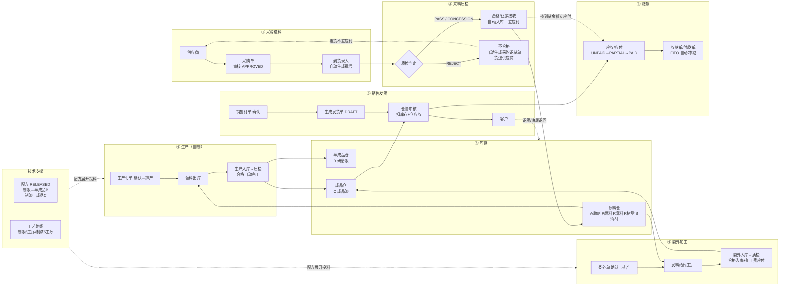

**核心串联模型**：物料表是中心，**物料编码（productCode）是唯一纽带**——配方、销售订单明细、生产订单都指向同一物料编码。配方/销售订单录入都必须从物料库中选 B（半成品）/C（成品）产品，不允许游离编码。

> ⚠️ 判断半成品/成品**必须看物料的「大类」字段**，不能按编码首字母猜（例如半成品编码是 PJ 开头，不是 B 开头）。

---

## 四、系统上线初始化

> 使用角色：SS/GM ｜ 时机：首次启用系统、新仓库启用

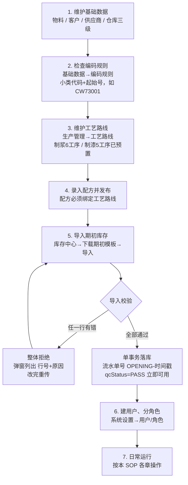

**操作要点**

1. **期初模板 8 列**：物料编码✅ / 物料名称 / 仓库名称✅ / 数量✅ / 单价 / 批号 / 生产日期 / 过期日期（✅=必填）。
2. **防重闸门**：已有库存的物料禁止导入（同一文件二次导入会全拒）——期初导入是一次性动作。
3. 每行一个批次；批号可填（须全局唯一）可留空自动生成；过期日期留空按物料质保期推算。
4. 特殊仓库**系统启动自动创建**，无需手工建：自有仓 WH-OWN-PY、委外仓（按代工厂）、**不合格品库 WH-UNQ**、**油尾库 WH-TAILING**。后两个仓**禁止改类型/删除/停用**。

---

## 五、配方与工艺路线（技术准备）

> 使用角色：TECH_LEAD / PM ｜ 菜单：生产管理 → 配方管理、工艺路线

### 5.1 配方版本生命周期

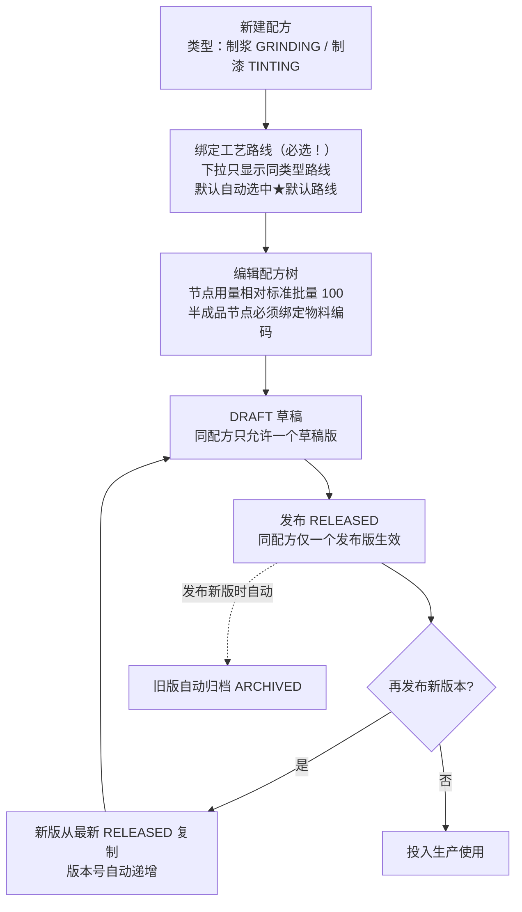

**操作要点**

1. **只有 RELEASED（已发布）版本可被生产订单/委外订单引用**；生产订单始终取该产品**最新发布版**。
2. 配方树可引用子配方（半成品）：展开时自动递归取子配方的 RELEASED 版本，实现"制浆→制漆"两阶段。
3. 制浆产**半成品（B，研磨浆）**，制漆产**成品（C，成品漆）**——浆和漆是两类物料。
4. 原材料节点支持**平替物料**（双向关系）一键切换，用量不变。
5. **打印贯通**：配方工艺指导单、生产投料单、委外单均按配方绑定的路线打印工序与步骤。
6. 配方名称（产品名）不允许重复，保存时系统查重。

### 5.2 工艺路线

- 路线 → 工序 → 步骤（支持 `{{N}}` 投料顺序占位符）→ 工序质检项。
- 同类型可建**多条命名路线**，每类型一条★默认路线（同类型新配方自动带出）。
- **删除拦截**：被配方引用的路线、默认路线均不可删除。
- 预置默认路线：制浆 6 工序（预混→砂磨→调色→过滤→打包留样送检→刷缸）、制漆 5 工序（预混/调漆→调色→过滤→打包留样送检→刷缸），可直接在管理页修改。

### 5.3 制漆配方的油尾节点（v5.35）

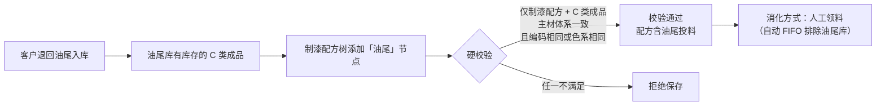

---

## 六、采购与来料质检

> 使用角色：BUYER 做单 → GM/PM 审核 → QC 判定 → STOREKEEPER 收货 ｜ 菜单：采购管理

### 6.1 采购到货质检全流程

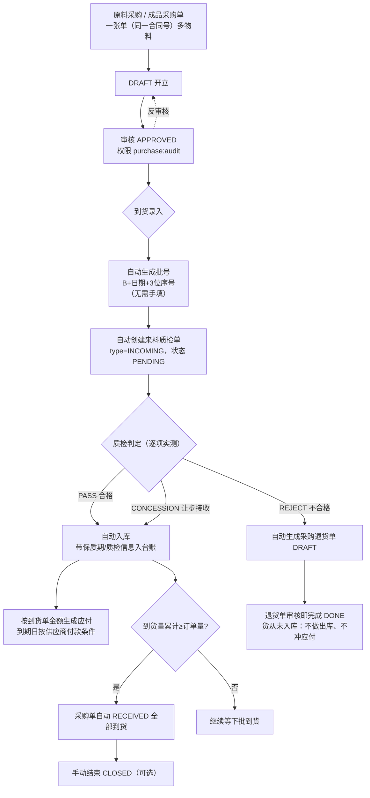

**操作要点**

1. 审核后的采购单才允许到货录入；**APPROVED 可反审核**回 DRAFT。
2. 到货录入时**批号系统自动生成**，一个批号从到货→质检→库存全链贯通；判定弹窗中检验员可按实物包装批号**补填/修正批号**。
3. 质检不合格的货**从未入库**，退货单审核通过即视为退货完成（直接退供应商），系统不产生退货出库、也不冲应付（收货才立应付）。
4. 质检判定按物料大类套用检测项模板并逐项录实测值（见第十二章）。
5. **低库存预警联动**：预警按「物料+仓库」触发，报表中可**一键生成采购单**（建议量=平均月用量，自动带目标仓库）。

---

## 七、生产管理

> 使用角色：PM 组织生产、排产 ｜ STOREKEEPER 领料/入库 ｜ QC 判定 ｜ 菜单：生产管理

### 7.1 生产全流程（订单 → 排产 → 领料 → 入库 → 完工）

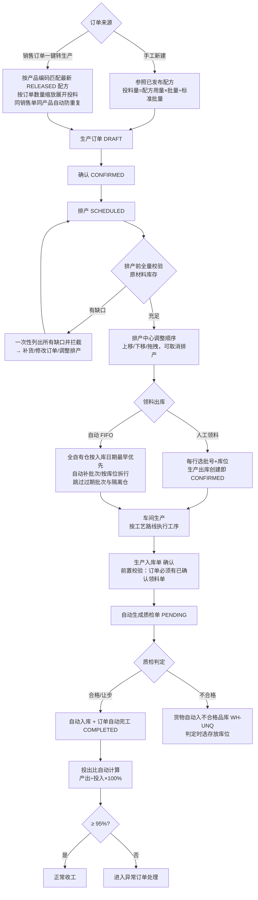

**操作要点**

1. **排产中心**（生产管理→排产中心）：只处理已确认订单，排产时做全量库存校验（缺任何原料都会被拦，且一次列全所有缺口，不用反复试）。
2. 生产出库单**创建即 CONFIRMED**，直接扣库存，没有确认按钮。
   - **领料差异处理（退料/补领）**：多领/错领走「生产领料」页**退料**——按订单勾选已领明细填退料数量（上限=可退量=已领−已退），库存按原批次原库位加回，成本自动冲减；少领走该页「参照订单领料」弹窗切**补领**模式——已领料订单可再次选择，只填本次追加用量，库存再扣、成本累加。
3. **生产入库前置校验**：订单必须存在已确认的领料出库单（没领料不能入库）；同一订单禁止重复参照入库；已完工订单不出现在参照下拉。
4. **自动完工**：入库质检合格（入库单 DONE）→ 订单状态自动 COMPLETED，无需手动点完工；手动「完工」按钮仅作兜底。
5. **投出比口径**：投入=Σ已确认领料量，产出=Σ已入库合格量，ratio=产出÷投入×100%；阈值 95%；无投入显示 UNKNOWN。
6. 订单展示状态优先级：已发货 > 已完工 > 已入库 > 已投料。

### 7.2 异常订单处理闭环

> 菜单：生产管理 → 异常订单处理；生产订单页「已完工」Tab 中异常单标红，可就地弹窗处理。

---

## 八、委外管理

> 使用角色：OUTSOURCE ｜ 菜单：委外管理

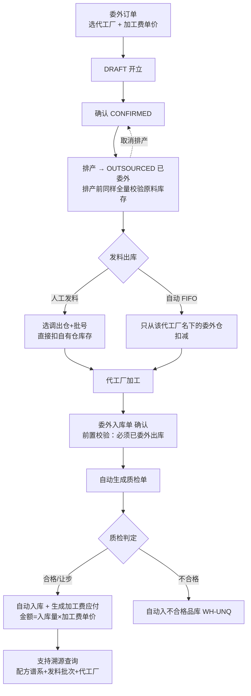

**操作要点**

1. 委外发料**不做调拨**：人工发料直接从自有仓扣减；自动 FIFO 从代工厂仓扣减——按实际业务二选一。
2. 委外入库与生产入库同样走质检前置，不合格货物入不合格品库（见 11.2）。

---

## 九、销售管理

> 使用角色：SALES 做单 → STOREKEEPER 发货 ｜ 菜单：销售管理

### 9.1 销售订单与发货

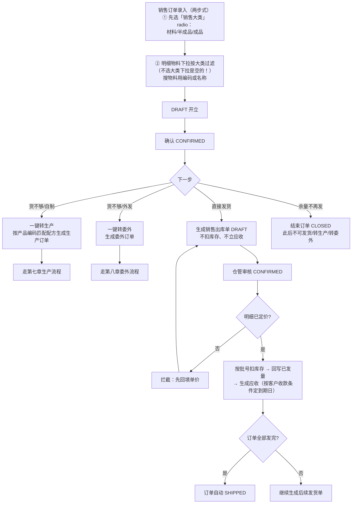

**操作要点**

1. **两步式录入**：必须先点「销售大类」单选（材料=A/P/F/R/S、半成品=B、成品=C），明细下拉才出该大类物料；切换大类会清空已录明细。
2. 到期日规则：款到发货=发货当天；账期N天=发货日+N天；月结/两月结/三月结=次月/次2月/次3月1号；货到付款=立账当天。
3. 发货单生成不占库存，**仓管审核那一刻才扣库存+立应收**，前后端有节奏差，注意协调。

### 9.2 销售退货

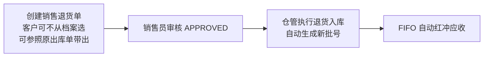

### 9.3 油尾退回与消化（v5.35）

客户退回**未用完的油漆（已加稀料）**的专门通道——不占用正常库存、不可再销售。

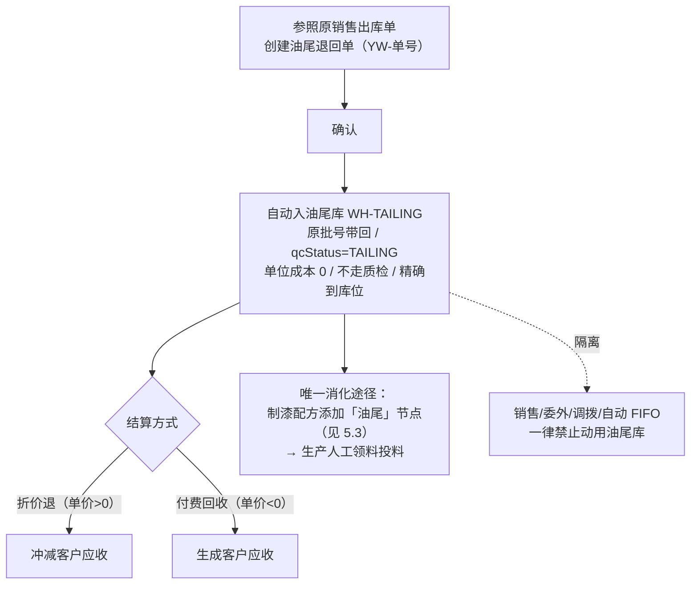

---

## 十、库存中心

> 使用角色：STOREKEEPER ｜ 菜单：库存中心

### 10.1 出库通用校验链（每次出库系统自动执行）

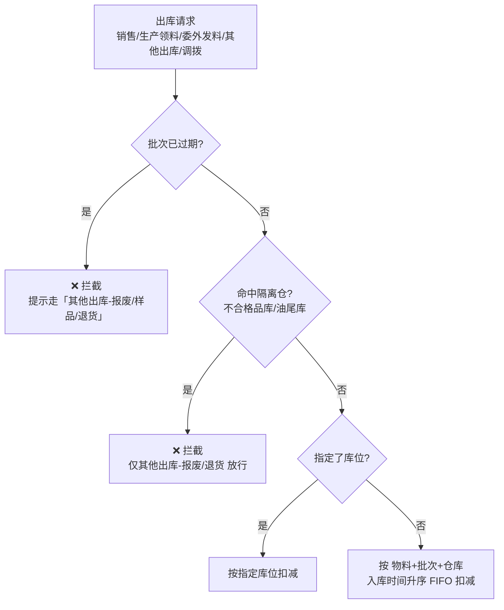

### 10.2 库存查询

- **双视图**：按编码（跨批次合计+均价）/ 按批次（每批次余量+质检信息）。
- **批次视图质检贯通**：批次行直接显示质检单号/检测结果/检验员/检验日期；行首展开看**检测项明细**（逐项标准值/实测值）；点「检测结果」弹出**完整质检报告单**（可打印）。
- 历史批次显示「未质检」属正常（该批次无质检记录，系统只做精确匹配，不跨批次兜底）。

### 10.3 日常操作

| 操作 | 路径 | 要点 |
|------|------|------|
| 跨仓调拨 | 库存查询/库存操作 | 禁止过期批次；不合格品库物料不可调出 |
| 盘点 | 盘库管理 | 盘盈 / 盘亏 / 库位调整三类，**确认立即生效** |
| 其他入库 | 其他入库 | 创建即 PENDING_QC 直接送检（不走确认按钮），批号+库位必选 |
| 其他出库 | 其他出库 | 用途必须选（报废/样品/退货等）；**是过期料与隔离仓库存的唯一合法出口（限报废/退货/样品）**；确认即扣库存 |
| 期初导入 | 库存查询工具栏 | 见第四章 |

### 10.4 预警

- **低库存预警**（报表中心）：按「物料+仓库」口径计算月用量/日用量/安全库存/可用天数；委外仓无出库记录不预警；可一键生成采购单。
- **过期预警**（报表中心）：临期/已过期批次清单，支持导出；过期料处理通道=其他出库-报废。

---

## 十一、质量管理

> 使用角色：QC ｜ 菜单：质量管理 → 质检管理、质检模板

### 11.1 质检模板体系（v5.32）

按物料大类自动套用 7 套默认检测项模板：

| 适用大类 | 模板 | 检测项数 |
|----------|------|----------|
| S 溶剂 | 溶剂模板 | 8 |
| R 树脂 | 树脂模板 | 10 |
| A 助剂 | 助剂模板 | 8 |
| P 颜料 | 颜料模板 | 10 |
| F 填料 | 填料模板 | 8 |
| B 半成品 | 研磨浆模板 | 8 |
| C 成品 | 成品漆出厂模板 | 12 |

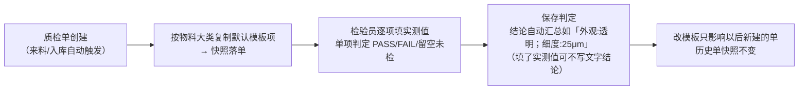

**操作要点**

1. 检测项内容在**质检模板管理页维护**（改页面即可，不要改代码）；同类别可建多套模板，只有「默认」那套生效。
2. 质检管理按被检物料类型分**材料/半成品/成品三个 Tab**。
3. 打印/预览共用同一张报告单；模板页可「预览效果」。
4. 判定弹窗可**补填批号**（按实物包装批号录入的兜底路径）。

### 11.2 质检判定与库存落点（全场景）

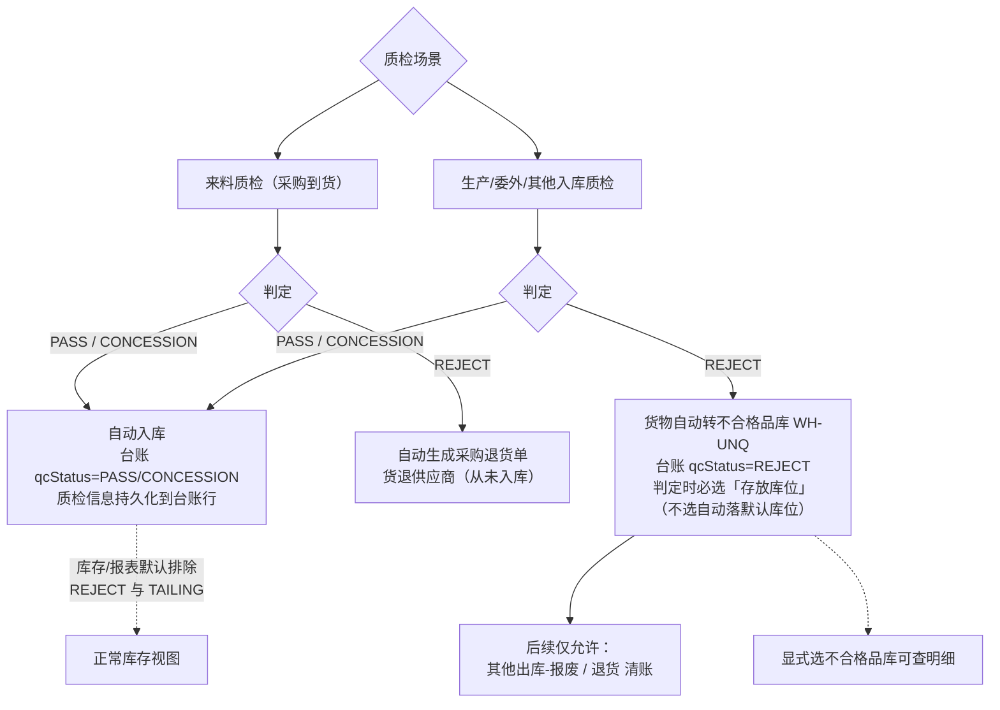

---

## 十二、财务管理

> 使用角色：FINANCE ｜ 菜单：财务管理 + 报表中心财务类

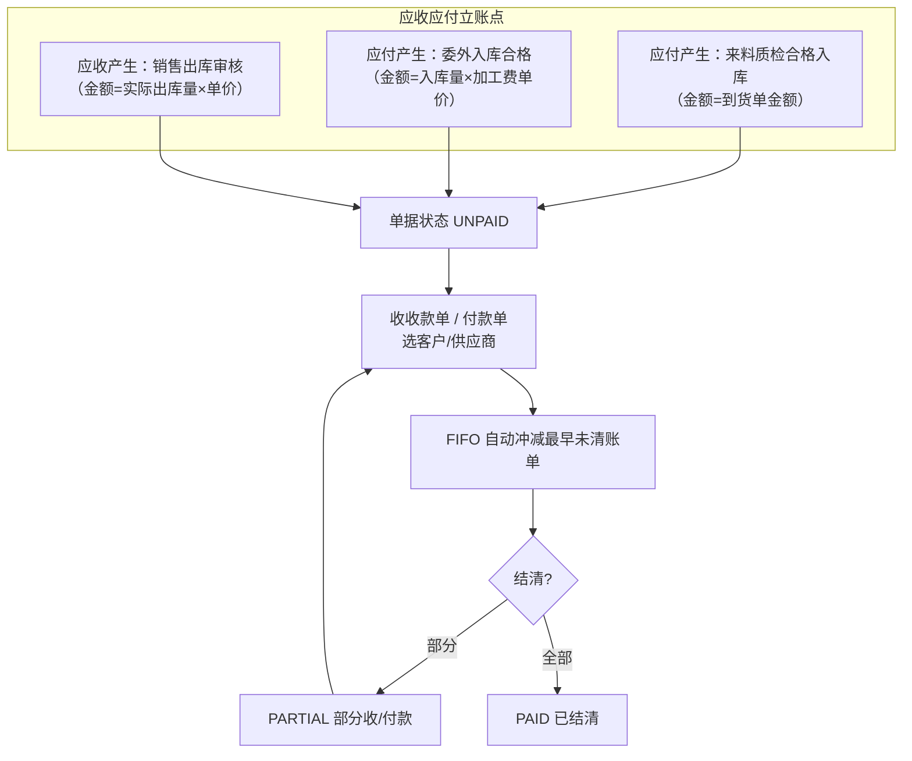

**报表支撑**：应收/应付明细、应收/应付总表、账龄分析、财务趋势分析（报表中心）。金额字段按权限显隐（需 purchase:price / finance:amount）。

---

## 十三、报表与看板

> 使用角色：GM / 各岗位 ｜ 菜单：报表中心（18 张）+ 工作台

| 看板/报表 | 用途 |
|-----------|------|
| 经营看板（驾驶舱） | 区间累计销售额/毛利 KPI、销售与毛利排行 TOP8、库存预警、订单执行全景，月份联动 |
| 工作台 | 统计卡、快捷操作、最新采购/销售订单、委外工单、月度订单与财务汇总 |
| 销售报表 / 采购报表 / 采购分析 | 量价走势、供应商结构 |
| 生产报表 / 生产进度表 | 产量、订单执行进度 |
| 库存报表 / 库存分析 | 库存结构、周转 |
| 委外报表 | 加工量与费用 |
| 低库存预警 / 过期预警 | 见 10.4 |
| 质检报表 | 合格率统计，含检测明细 |
| 账龄 / 应收应付 / 趋势 | 财务分析（第十二章） |

---

## 十四、系统管理

> 使用角色：SS ｜ 菜单：系统设置

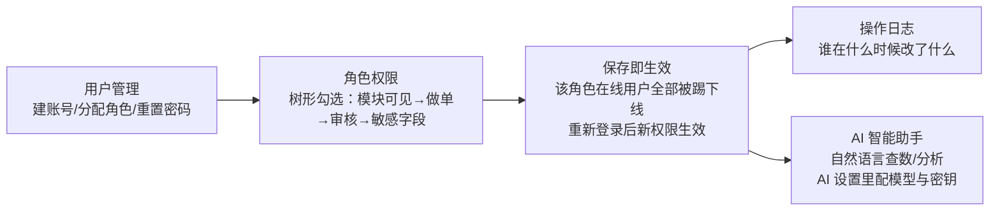

**操作日志**

- 记录范围：所有写操作（增/删/改）+ 登录成功/失败；查询不记录。
- 内容：时间、账号、IP、模块、参数（密码/密钥自动脱敏）、耗时。
- 保留策略：**在线可查近 30 天**（查询跨度上限 93 天）；超 30 天自动归档（归档查询入口按月检索）；归档保留 12 个月后自动清理。**无需人工维护**。

**运维提醒**：系统升级部署后，各用户浏览器可能仍用旧页面缓存，需**刷新页面**（必要时 Ctrl+F5）才能看到新功能。

---

## 附录 A：单据状态机速查表

| 单据 | 状态流转 | 关键自动点 |
|------|----------|------------|
| 采购单（原料/成品） | 开立 → 已审核 → 全部到货 / 已结束（可反审核） | 到货量达标自动「全部到货」 |
| 来料/出厂质检单 | 待检 → 合格 / 让步接收 / 退货 | 合格自动入库+立应付；不合格自动开退货单 |
| 生产订单 | 开立 → 已确认 → 已排产 → 已完工 | 入库质检合格**自动完工**；投出比<95% 进异常列表 |
| 生产出库单（领料） | 创建即已确认（扣库存） | 自动 FIFO 跳过过期/隔离仓 |
| 生产/委外入库单 | 确认（=待质检）→ 完成 / 质检退货 | 合格自动入正式仓；不合格自动入不合格品库 |
| 委外订单 | 开立 → 已确认 → 已委外 → 已完工（可取消排产） | 排产校验库存；入库合格生成加工费应付 |
| 销售订单 | 开立 → 已确认 → 已发货 / 已结束 | 全部发完自动「已发货」；结束后不可再发货/转单 |
| 销售出库单 | 草稿（不扣库存）→ 已确认（扣库存+立应收） | 未定价拦截审核 |
| 采购退货单 | 草稿 → 完成（质检退货）/ 已审核 → 完成（手工退货） | 质检退货不出库、不冲应付 |
| 销售退货单 | 草稿 → 已审核 → 完成 | 退货入库自动红冲应收 |
| 油尾退回单 | 草稿 → 完成（确认即入油尾库） | 不走质检；折价退冲应收 |
| 其他入库单 | 创建即待质检 → 判定后入库 | — |
| 其他出库单 | 草稿 → 已确认（扣库存） | 过期料/隔离仓唯一合法出口（限报废/退货/样品） |
| 盘库单 | 确认即生效 | — |
| 应收/应付 | 未付 → 部分收付 → 已结清 | 收付款 FIFO 自动冲减 |
| 配方版本 | 草稿 → 已发布 → 已归档 | 新版发布旧版自动归档 |
| 异常订单处置 | 待处理 → 处理中 → 已闭环（可重开） | — |

## 附录 B：常见问题速查

| 现象 | 原因与处理 |
|------|------------|
| 操作中突然掉线/401 | 单点登录：同账号在别处登录把您顶掉了，属正常保护机制 |
| 销售订单明细搜不到物料 | 没先选「销售大类」，选大类后下拉才会出对应物料 |
| 某批次显示「未质检」 | 该批次入库早于质检信息持久化功能且无精确匹配质检单，属正常显示 |
| 出库报「批次已过期」 | 过期批次禁止正常出库；确需处理走 其他出库 → 报废/样品/退货 |
| 出库选不到某批货 | 该批在不合格品库/油尾库（隔离），或已被上次出库扣完 |
| 部署更新后看不到新功能 | 浏览器 SPA 缓存，刷新页面（Ctrl+F5） |
| 生产订单入库后状态没变「已完工」 | 不会发生：入库质检合格即自动完工；历史遗留单系统启动时已自动补全 |
| 半成品编码是 PJ 开头不是 B | 编码按小类规则生成；判断类别看物料「大类」字段，不看编码首字母 |
| 质检判定结果跟以前不一样了 | 改质检模板只影响新建单；历史单持有当时快照，不受影响 |
| 采购退货后应付没减少 | 正常：质检不合格的货从未入库立账，退货不产生任何出库与冲账 |
